# Diagramme de séquence - Encodage et diffusion vidéo/audio

Ce diagramme explique le processus complet d'encodage et de diffusion de contenu vidéo/audio, depuis l'upload sur R2 jusqu'à la lecture du contenu encodé.

## Flux complet d'encodage et diffusion

```mermaid
sequenceDiagram
    participant Admin as Admin<br/>(Utilisateur)
    participant R2 as Cloudflare R2<br/>(Stockage)
    participant API as M3U8 Encoder Service<br/>(UploadController)
    participant JobSvc as JobService
    participant DB as MongoDB<br/>(Jobs Collection)
    participant SSE as EventService<br/>(SSE)
    participant FFmpeg as FFmpeg<br/>(Encodage)
    participant R2Upload as R2StorageService<br/>(Upload vers R2)
    participant Proxy as ProxyController<br/>(Diffusion)
    participant Client as Client<br/>(Lecteur vidéo)

    Note over Admin,R2: 1. Upload du fichier sur R2
    Admin->>R2: Upload fichier vidéo/audio<br/>(MP4, MKV, MP3, etc.)
    R2-->>Admin: URL du fichier<br/>(ex: https://r2.example.com/file.mp4)

    Note over Admin,API: 2. Création du job d'encodage
    Admin->>API: POST /api/v2/m3u8-encoder/upload/url<br/>{<br/>  "url": "https://r2.example.com/file.mp4",<br/>  "title": "Épisode 1 - Le Commencement",<br/>  "resourceType": "VIDEO"<br/>}<br/>Headers: x-auth-email, x-auth-name, x-auth-sub, x-auth-scope

    API->>API: Génère slug depuis title<br/>"Épisode 1 - Le Commencement"<br/>→ "episode-1-le-commencement"
    API->>JobSvc: createJob(title, resourceType, ...)
    JobSvc->>JobSvc: Génère jobId unique<br/>(ex: job-123e4567-...)
    JobSvc->>DB: Sauvegarde Job<br/>{<br/>  jobId, slug, title,<br/>  status: DOWNLOADING,<br/>  resourceType: VIDEO<br/>}
    DB-->>JobSvc: Job créé
    JobSvc-->>API: Job créé avec jobId

    API-->>Admin: 201 Accepted<br/>{<br/>  "status": "accepted",<br/>  "jobId": "job-123e4567-...",<br/>  "slug": "episode-1-le-commencement",<br/>  "title": "Épisode 1 - Le Commencement",<br/>  "jobStatus": "DOWNLOADING",<br/>  "statusUrl": "/api/v2/m3u8-encoder/status/...",<br/>  "jobUrl": "/api/v2/m3u8-encoder/jobs/..."<br/>}

    Note over Admin,SSE: 3. Suivi de la progression via SSE
    Admin->>SSE: GET /api/v2/m3u8-encoder/events<br/>?jobId=job-123e4567-...
    SSE-->>Admin: SSE Connection établie<br/>Event: "connected"

    Note over JobSvc,R2Upload: 4. Traitement asynchrone du job
    JobSvc->>JobSvc: processJobAsync(job)
    
    Note over JobSvc,R2: 4a. Téléchargement depuis R2
    JobSvc->>R2: GET https://r2.example.com/file.mp4<br/>(Téléchargement résumable)
    R2-->>JobSvc: Stream du fichier
    JobSvc->>JobSvc: Mise à jour progression<br/>status: DOWNLOADING<br/>progressPercentage: 0-100%
    JobSvc->>DB: Update Job (progression)
    JobSvc->>SSE: dispatchJobProgressionToSEEClients()
    SSE-->>Admin: Event: "job-update"<br/>{progressPercentage, status, ...}

    Note over JobSvc,FFmpeg: 4b. Encodage HLS ABR
    JobSvc->>JobSvc: updateJobStatus(jobId, ENCODING)
    JobSvc->>FFmpeg: Génère variantes vidéo<br/>v0: 1080p (1920x1080)<br/>v1: 720p (1280x720)<br/>v2: 480p (854x480)<br/>v3: 360p (640x360)
    
    loop Pour chaque variante vidéo
        FFmpeg->>FFmpeg: Encodage variante (libx264)
        FFmpeg->>JobSvc: Callback progression<br/>(variantProgressPercentage: 0-100%)
        JobSvc->>DB: Update Job<br/>(currentVariant, variantProgressPercentage)
        JobSvc->>SSE: dispatchJobProgressionToSEEClients()
        SSE-->>Admin: Event: "job-update"<br/>{currentVariant, variantProgressPercentage, ...}
    end

    alt Si resourceType = AUDIO
        FFmpeg->>FFmpeg: Génère variantes audio<br/>a0: 192kbps AAC<br/>a1: 128kbps AAC<br/>a2: 96kbps AAC
        loop Pour chaque variante audio
            FFmpeg->>FFmpeg: Encodage variante audio
            FFmpeg->>JobSvc: Callback progression
            JobSvc->>SSE: dispatchJobProgressionToSEEClients()
            SSE-->>Admin: Event: "job-update"
        end
    end

    Note over JobSvc,R2Upload: 4c. Upload vers R2
    JobSvc->>JobSvc: updateJobStatus(jobId, UPLOADING_TO_CLOUD_STORAGE)
    JobSvc->>R2Upload: Upload segments et playlists vers R2
    
    loop Pour chaque segment/variante
        R2Upload->>R2: Upload segment/playlist<br/>Key: {slug}/{jobId}/{variant}/segment.ts
        R2-->>R2Upload: Upload réussi
        R2Upload->>JobSvc: updateSegmentCounts(...)
        JobSvc->>SSE: dispatchJobProgressionToSEEClients()
        SSE-->>Admin: Event: "job-update"<br/>{completedSegments, totalSegments, ...}
    end

    Note over JobSvc,SSE: 5. Finalisation du job
    JobSvc->>JobSvc: updateJobCompletion(jobId, ...)<br/>masterPlaylistUrl, securePlaybackUrl, keyPrefix
    JobSvc->>DB: Update Job<br/>status: COMPLETED<br/>masterPlaylistUrl, variants, ...
    JobSvc->>SSE: notifyJobCompletion(jobId, completedJob)
    SSE-->>Admin: Event: "job-completed"<br/>{<br/>  jobId, status: "completed",<br/>  masterPlaylistUrl,<br/>  securePlaybackUrl,<br/>  variants: {...}<br/>}

    Note over Client,Proxy: 6. Lecture du contenu encodé
    Client->>Proxy: GET /m3u8-encoder/api/v2/proxy/{jobId}<br/>(Master playlist adaptative)
    
    Proxy->>DB: Recherche MasterPlaylistRecord par jobId
    DB-->>Proxy: MasterPlaylistRecord trouvé
    Proxy->>R2: GET master.m3u8 depuis R2
    R2-->>Proxy: Master playlist<br/>(contient toutes les variantes)
    Proxy->>Proxy: Réécrit URLs avec tokens sécurisés
    Proxy-->>Client: Master playlist adaptative<br/>#EXTM3U<br/>#EXT-X-STREAM-INF:...<br/>v0/index.m3u8<br/>v1/index.m3u8<br/>v2/index.m3u8<br/>v3/index.m3u8

    Note over Client,Proxy: 7. Lecture d'une variante spécifique (optionnel)
    Client->>Proxy: GET /m3u8-encoder/api/v2/proxy/{jobId}/{variant}/index.m3u8<br/>variant = v0|v1|v2|v3|a0|a1|a2
    
    Proxy->>DB: Recherche MasterPlaylistRecord par jobId
    Proxy->>R2: GET {variant}/index.m3u8 depuis R2
    R2-->>Proxy: Variant playlist<br/>(liste des segments)
    Proxy->>Proxy: Réécrit URLs des segments<br/>avec tokens sécurisés
    Proxy-->>Client: Variant playlist<br/>#EXTM3U<br/>#EXTINF:...<br/>segment001.ts<br/>segment002.ts<br/>...

    Client->>Proxy: GET /m3u8-encoder/api/v2/proxy/{jobId}/{variant}/segment001.ts<br/>(avec token)
    Proxy->>R2: GET segment depuis R2
    R2-->>Proxy: Segment vidéo/audio binaire
    Proxy-->>Client: Segment binaire<br/>(streaming)

    Note over Admin,API: 8. Annulation du job (optionnel)
    Admin->>API: POST /api/v2/m3u8-encoder/jobs/{jobId}/cancel
    API->>JobSvc: cancelJob(jobId)
    JobSvc->>FFmpeg: stopProcess(jobId)
    JobSvc->>JobSvc: updateJobStatus(jobId, CANCELLED)
    JobSvc->>DB: Update Job status: CANCELLED
    JobSvc->>SSE: notifyJobCancellation(jobId, cancelledJob)
    SSE-->>Admin: Event: "job-cancelled"
    JobSvc->>JobSvc: cleanupJobDirectories(job)
    JobSvc-->>API: Job annulé
    API-->>Admin: 200 OK<br/>{message: "Job cancelled successfully"}
```



## Points clés

#### IMPORTANT : Si vous passez par la gateway ceci "Headers:  x-auth-email, x-auth-name, x-auth-sub, x-auth-scope" n'est pas requis car , il envoyé automatiquement par la gateway.

### 1. Upload et création du job
- L'**admin** upload le fichier sur **Cloudflare R2** et obtient l'URL
- L'admin envoie une requête POST avec :
  - `url` : URL du fichier sur R2
  - `title` : Titre du contenu (devient le slug)
  - `resourceType` : `VIDEO` ou `AUDIO`
- Le service génère un `jobId` unique et un `slug` depuis le titre
- **Important** : Les contenus avec le même `title` sont regroupés dans la même collection (même slug)

### 2. Suivi de progression via SSE
- Le client se connecte à `/api/v2/m3u8-encoder/events?jobId={jobId}`
- Événements SSE envoyés :
  - `connected` : Connexion établie
  - `job-update` : Mise à jour de progression (périodique)
  - `job-completed` : Job terminé avec succès
  - `job-failed` : Échec du job
  - `job-cancelled` : Job annulé

### 3. Processus d'encodage
- **DOWNLOADING** : Téléchargement depuis R2 avec progression
- **ENCODING** : Génération des variantes HLS ABR
  - **Vidéo** : v0 (1080p), v1 (720p), v2 (480p), v3 (360p)
  - **Audio** : a0 (192kbps), a1 (128kbps), a2 (96kbps)
- **UPLOADING_TO_CLOUD_STORAGE** : Upload des segments et playlists vers R2
- **COMPLETED** : Job terminé, contenu disponible

### 4. Diffusion du contenu
- **Master playlist adaptative** : `GET /proxy/{jobId}`
  - Retourne toutes les variantes disponibles
  - Le lecteur choisit automatiquement la meilleure qualité selon la bande passante
- **Variante spécifique** : `GET /proxy/{jobId}/{variant}/index.m3u8`
  - Permet de forcer une qualité spécifique
  - Variantes vidéo : `v0`, `v1`, `v2`, `v3`
  - Variantes audio : `a0`, `a1`, `a2`

### 5. Regroupement par titre
- **Même titre = Même slug = Même collection**
- Exemple pour une série :
  - Upload 1 : `title: "Série X - Épisode 1"` → slug: `serie-x-episode-1`
  - Upload 2 : `title: "Série X - Épisode 1"` → slug: `serie-x-episode-1` (même collection)
  - Upload 3 : `title: "Série X - Épisode 2"` → slug: `serie-x-episode-2` (collection différente)
- Utile pour l'affichage des structures de fichiers sur Cloudflare R2

## Exemple concret

### Étape 1 : Upload et création
```json
POST /api/v2/m3u8-encoder/upload/url
{
  "url": "https://r2.example.com/episode1.mp4",
  "title": "Série X - Épisode 1",
  "resourceType": "VIDEO"
}

Response: 201 Accepted
{
  "jobId": "job-abc123",
  "slug": "serie-x-episode-1",
  "title": "Série X - Épisode 1",
  "status": "accepted"
}
```

### Étape 2 : Suivi SSE
```
GET /api/v2/m3u8-encoder/events?jobId=job-abc123

Events reçus:
- connected: {"ok": true}
- job-update: {"jobId": "job-abc123", "status": "ENCODING", "currentVariant": 1, "variantProgressPercentage": 45}
- job-update: {"jobId": "job-abc123", "status": "UPLOADING_TO_CLOUD_STORAGE", "completedSegments": 150, "totalSegments": 200}
- job-completed: {"jobId": "job-abc123", "status": "completed", "masterPlaylistUrl": "..."}
```

### Étape 3 : Lecture adaptative
```
GET /m3u8-encoder/api/v2/proxy/job-abc123

Response: Master playlist avec toutes les variantes
#EXTM3U
#EXT-X-STREAM-INF:BANDWIDTH=5000000,RESOLUTION=1920x1080
v0/index.m3u8
#EXT-X-STREAM-INF:BANDWIDTH=2800000,RESOLUTION=1280x720
v1/index.m3u8
#EXT-X-STREAM-INF:BANDWIDTH=1400000,RESOLUTION=854x480
v2/index.m3u8
#EXT-X-STREAM-INF:BANDWIDTH=800000,RESOLUTION=640x360
v3/index.m3u8
```

### Étape 4 : Lecture qualité spécifique
```
GET /m3u8-encoder/api/v2/proxy/job-abc123/v1/index.m3u8

Response: Playlist 720p uniquement
#EXTM3U
#EXTINF:10.0,
segment001.ts
#EXTINF:10.0,
segment002.ts
...
```

## Variantes disponibles

### Vidéo
- **v0** : 1080p (1920x1080) - Bande passante ~5 Mbps
- **v1** : 720p (1280x720) - Bande passante ~2.8 Mbps
- **v2** : 480p (854x480) - Bande passante ~1.4 Mbps
- **v3** : 360p (640x360) - Bande passante ~800 Kbps

### Audio
- **a0** : 192 kbps AAC - Qualité haute
- **a1** : 128 kbps AAC - Qualité moyenne
- **a2** : 96 kbps AAC - Qualité basse

## Avantages de cette architecture

1. **Qualité adaptative** : Le lecteur choisit automatiquement la meilleure qualité selon la bande passante
2. **Flexibilité** : Possibilité de forcer une qualité spécifique si nécessaire
3. **Suivi en temps réel** : SSE permet de suivre la progression de l'encodage
4. **Regroupement intelligent** : Les contenus avec le même titre sont automatiquement regroupés
5. **Sécurité** : URLs signées avec tokens pour protéger le contenu
6. **Scalabilité** : Stockage sur Cloudflare R2 avec CDN intégré

