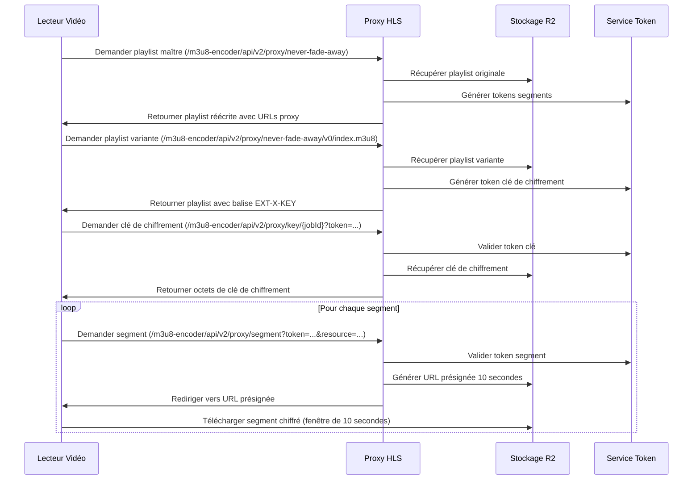

# 🔐 Architecture de Sécurité HLS : Système de Protection Multi-Couches

## 📋 Vue d'ensemble

Ce document explique l'architecture de sécurité complète implémentée pour la protection du contenu HLS (HTTP Live Streaming). Notre système utilise **plusieurs couches de sécurité** pour rendre le vol de contenu extrêmement difficile tout en maintenant une excellente expérience utilisateur.

## 🏗️ Architecture de Sécurité

### **Couche 1 : Tokens JWT au Niveau des Segments**
- Chaque segment vidéo reçoit un **token JWT unique**
- Les tokens sont liés à des **ressources segment spécifiques**
- La validation du token inclut une **correspondance exacte de la ressource**
- Empêche la réutilisation du token sur différents segments

### **Couche 2 : URLs Présignées Ultra-Courtes (10 secondes)**
- Après validation JWT, génère des URLs présignées de 10 secondes
- Crée une fenêtre de téléchargement extrêmement étroite
- Force la consommation en temps réel plutôt que le téléchargement en masse

### **Couche 3 : Chiffrement AES-128**
- Tous les segments vidéo sont chiffrés en utilisant AES-128
- Les clés de chiffrement sont stockées séparément et protégées
- Le contenu est inutile sans la clé de déchiffrement correspondante

### **Couche 4 : Protection des Clés de Chiffrement**
- Tokens JWT séparés pour l'accès aux clés de chiffrement
- Les clés sont servies via des endpoints proxy protégés
- Accès limité dans le temps aux clés de chiffrement

## 🔄 Comment Ça Fonctionne (Flux Utilisateur Normal)



## 🛡️ Fonctionnalités de Sécurité

### **1. Tokens Segment Uniques**
```java
// Chaque segment reçoit son propre token lié à une ressource spécifique
String segmentKey = keyPrefix + "/" + variant + "/" + segmentFilename;
String token = tokenService.generateSegmentTokenWithDuration(segmentKey, userAgent, videoDurationSeconds);
```

### **2. Validation de Ressource**
```java
// Le token doit correspondre exactement à la ressource demandée
if (!resourceKey.equals(validation.getResourceKey())) {
    return ResponseEntity.status(HttpStatus.FORBIDDEN).build();
}
```

### **3. URLs Présignées Ultra-Courtes**
```java
// Seulement 10 secondes pour télécharger après obtention de l'URL
String presignedUrl = storageService.generatePresignedUrl(resourceKey, 10);
```

### **4. Expirations Couplées**
- Tokens HLS (segments/clé) : durée vidéo + buffer (`security.jwt.buffer-minutes`, défaut 30) ou 15 min si la durée est inconnue.
- URL présignée R2 : 10 secondes uniquement. Même si le token est encore valide, l’URL courte limite le téléchargement massif.

### **4. Contenu Chiffré**
```bash
# FFmpeg chiffre les segments pendant l'encodage
ffmpeg -i input.mp4 -hls_key_info_file keyinfo.txt -f hls output.m3u8
```

## 🚨 Ce Qu'Affronte un Voleur de Contenu

### **Scénario d'Attaque 1 : Tentative de Téléchargement Simple**
```bash
# Le voleur essaie de télécharger la playlist
curl "http://localhost:8080/m3u8-encoder/api/v2/proxy/never-fade-away/v0/index.m3u8" > playlist.m3u8

# La playlist contient des URLs proxy avec tokens uniques :
# http://localhost:8080/m3u8-encoder/api/v2/proxy/segment?token=JWT_SEGMENT_001&resource=seg_0001.ts
# http://localhost:8080/m3u8-encoder/api/v2/proxy/segment?token=JWT_SEGMENT_002&resource=seg_0002.ts

# Essaie téléchargement en masse
ffmpeg -i playlist.m3u8 -c copy stolen.mp4
# ❌ ÉCHOUE : Chaque requête de segment passe par validation proxy
```

### **Scénario d'Attaque 2 : Téléchargement Manuel de Segments**
```bash
# Le voleur essaie de télécharger les segments manuellement
curl "http://localhost:8080/m3u8-encoder/api/v2/proxy/segment?token=JWT_SEGMENT_001&resource=seg_0001.ts"
# ✅ Obtient redirection vers URL présignée (valide 10 secondes)

curl "https://r2-storage.com/presigned-url-expires-in-10-seconds"
# ⏰ Doit télécharger dans les 10 secondes ou l'URL expire

# Essaie le segment suivant
curl "http://localhost:8080/proxy/segment?token=JWT_SEGMENT_002&resource=seg_0002.ts"
# ⏰ Une autre fenêtre de 10 secondes, doit être rapide !
```

### **Scénario d'Attaque 3 : Tentative de Réutilisation de Token**
```bash
# Le voleur essaie de réutiliser un token pour un segment différent
curl "http://localhost:8080/m3u8-encoder/api/v2/proxy/segment?token=JWT_SEGMENT_001&resource=seg_0002.ts"
# ❌ ÉCHOUE : La validation du token vérifie la correspondance exacte de ressource
# Erreur : "Token resource mismatch"
```

### **Scénario d'Attaque 4 : Vol de Clé de Chiffrement**
```bash
# Même si le voleur obtient tous les segments, ils sont chiffrés
# Nécessite la clé de chiffrement avec token séparé
curl "http://localhost:8080/m3u8-encoder/api/v2/proxy/key/job-123?token=KEY_TOKEN"
# ⏰ Le token clé expire aussi, doit coordonner avec téléchargements segments
```

## 😈 Le Cauchemar du Voleur

Pour voler du contenu avec succès, un voleur devrait :

### **Exigences Techniques :**
1. **Traitement temps réel** - Analyser la playlist et extraire les URLs instantanément
2. **Téléchargement parallèle** - Télécharger plusieurs segments simultanément dans des fenêtres de 10 secondes
3. **Gestion des tokens** - Gérer des tokens uniques pour chaque segment
4. **Gestion du chiffrement** - Obtenir et gérer les clés de chiffrement
5. **Compétences d'assemblage** - Déchiffrer et réassembler les segments en vidéo lisible

### **Contraintes de Timing :**
- ⏰ **10 secondes par segment** pour télécharger depuis l'URL présignée
- 🔄 **Dépendance séquentielle** - Doit obtenir playlist → extraire URLs → télécharger segments
- 🎯 **Précision requise** - Tout retard signifie URLs expirées et téléchargements échoués

### **Exigences de Ressources :**
- 💻 **Bande passante élevée** - Doit télécharger plus vite que les URLs expirent
- 🧠 **Expertise technique** - Compréhension de HLS, chiffrement, tokens JWT
- 🛠️ **Outillage personnalisé** - Les outils standards comme `ffmpeg` ne fonctionneront pas à cause de la couche proxy

## 📊 Efficacité de la Sécurité

| Vecteur d'Attaque | Difficulté | Taux de Réussite | Notes |
|------------------|------------|------------------|-------|
| **Téléchargement Simple** | 🟢 Facile à tenter | ❌ 0% | Couche proxy bloque les outils standards |
| **Script Manuel** | 🟡 Effort modéré | 🔴 <5% | Nécessite coordination temps réel |
| **Automatisation Avancée** | 🔴 Haute expertise | 🟡 ~20% | Possible mais nécessite compétences significatives |
| **Téléchargement Masse/Lot** | 🟢 Facile à tenter | ❌ 0% | Fenêtres de 10 secondes empêchent opérations en masse |

## 🎯 Pourquoi Ça Fonctionne

### **Pour les Utilisateurs Légitimes :**
- ✅ **Expérience fluide** - Les lecteurs vidéo gèrent la gestion des tokens automatiquement
- ✅ **Aucune interruption** - Les tokens sont valides pour la durée vidéo + tampon
- ✅ **Chargement rapide** - Les fenêtres de 10 secondes sont suffisantes pour le streaming temps réel
- ✅ **Chiffrement configurable** - `hls.encryption.enabled` peut être désactivé en environnement de test si les clés/IV ne sont pas générés

### **Contre les Voleurs de Contenu :**
- 🚫 **Pression temporelle** - Fenêtres de téléchargement extrêmement étroites
- 🚫 **Barrières techniques** - Plusieurs couches nécessitent expertise pour contourner
- 🚫 **Ressources intensives** - Exigences élevées en bande passante et traitement
- 🚫 **Complexité de coordination** - Doit orchestrer plusieurs opérations simultanées

## 🏆 Conclusion

Cette architecture de sécurité multi-couches crée une approche de **"sécurité par complexité"** où :

1. **Chaque couche seule** fournit une protection modérée
2. **Les couches combinées** créent une difficulté exponentielle
3. **Les contraintes de temps** rendent l'automatisation extrêmement difficile
4. **Les exigences de ressources** dissuadent les tentatives de vol occasionnelles

Le système atteint une **protection de contenu de niveau entreprise** tout en maintenant une excellente expérience utilisateur pour les spectateurs légitimes.

---

*"La meilleure sécurité ne consiste pas seulement à rendre le vol impossible, mais à le rendre si difficile et gourmand en ressources qu'il n'en vaut pas la peine."*
