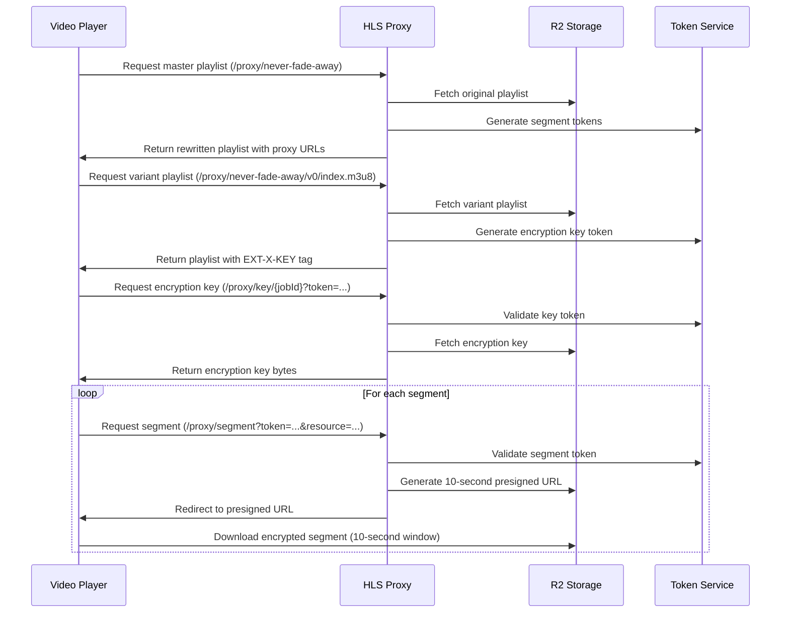

# 🔐 HLS Security Architecture: Multi-Layer Protection System

## 📋 Overview

This document explains the comprehensive security architecture implemented for HLS (HTTP Live Streaming) content protection. Our system uses **multiple layers of security** to make content theft extremely difficult while maintaining excellent user experience.

## 🏗️ Security Architecture

### **Layer 1: Segment-Level JWT Tokens**
- Every video segment gets a **unique JWT token**
- Tokens are tied to **specific segment resources**
- Token validation includes **exact resource matching**
- Prevents token reuse across different segments

### **Layer 2: Ultra-Short Presigned URLs (10 seconds)**
- After JWT validation, generates 10-second presigned URLs
- Creates an extremely narrow download window
- Forces real-time consumption rather than bulk downloading

### **Layer 3: AES-128 Encryption**
- All video segments are encrypted using AES-128
- Encryption keys are stored separately and protected
- Content is useless without the corresponding decryption key

### **Layer 4: Encryption Key Protection**
- Separate JWT tokens for encryption key access
- Keys are served through protected proxy endpoints
- Time-limited access to encryption keys

## 🔄 How It Works (Normal User Flow)


```mermaid
sequenceDiagram
    participant User as Video Player
    participant Proxy as HLS Proxy
    participant Storage as R2 Storage
    participant Token as Token Service

    User->>Proxy: Request master playlist (/proxy/never-fade-away)
    Proxy->>Storage: Fetch original playlist
    Proxy->>Token: Generate segment tokens
    Proxy->>User: Return rewritten playlist with proxy URLs

    User->>Proxy: Request variant playlist (/proxy/never-fade-away/v0/index.m3u8)
    Proxy->>Storage: Fetch variant playlist
    Proxy->>Token: Generate encryption key token
    Proxy->>User: Return playlist with EXT-X-KEY tag

    User->>Proxy: Request encryption key (/proxy/key/{jobId}?token=...)
    Proxy->>Token: Validate key token
    Proxy->>Storage: Fetch encryption key
    Proxy->>User: Return encryption key bytes

    loop For each segment
        User->>Proxy: Request segment (/proxy/segment?token=...&resource=...)
        Proxy->>Token: Validate segment token
        Proxy->>Storage: Generate 10-second presigned URL
        Proxy->>User: Redirect to presigned URL
        User->>Storage: Download encrypted segment (10-second window)
    end
```

## 🛡️ Security Features

### **1. Unique Segment Tokens**
```java
// Each segment gets its own token tied to specific resource
String segmentKey = keyPrefix + "/" + variant + "/" + segmentFilename;
String token = tokenService.generateSegmentTokenWithDuration(segmentKey, userAgent, videoDurationSeconds);
```

### **2. Resource Validation**
```java
// Token must match exactly the requested resource
if (!resourceKey.equals(validation.getResourceKey())) {
    return ResponseEntity.status(HttpStatus.FORBIDDEN).build();
}
```

### **3. Ultra-Short Presigned URLs**
```java
// Only 10 seconds to download after getting the URL
String presignedUrl = storageService.generatePresignedUrl(resourceKey, 10);
```

### **4. Encrypted Content**
```bash
# FFmpeg encrypts segments during encoding
ffmpeg -i input.mp4 -hls_key_info_file keyinfo.txt -f hls output.m3u8
```

## 🚨 What a Content Thief Faces

### **Attack Scenario 1: Simple Download Attempt**
```bash
# Thief tries to download playlist
curl "http://localhost:8080/proxy/never-fade-away/v0/index.m3u8" > playlist.m3u8

# Playlist contains proxy URLs with unique tokens:
# http://localhost:8080/proxy/segment?token=JWT_SEGMENT_001&resource=seg_0001.ts
# http://localhost:8080/proxy/segment?token=JWT_SEGMENT_002&resource=seg_0002.ts

# Tries bulk download
ffmpeg -i playlist.m3u8 -c copy stolen.mp4
# ❌ FAILS: Each segment request goes through proxy validation
```

### **Attack Scenario 2: Manual Segment Download**
```bash
# Thief tries to download segments manually
curl "http://localhost:8080/proxy/segment?token=JWT_SEGMENT_001&resource=seg_0001.ts"
# ✅ Gets redirected to presigned URL (valid for 10 seconds)

curl "https://r2-storage.com/presigned-url-expires-in-10-seconds"
# ⏰ Must download within 10 seconds or URL expires

# Tries next segment
curl "http://localhost:8080/proxy/segment?token=JWT_SEGMENT_002&resource=seg_0002.ts"
# ⏰ Another 10-second window, must be fast!
```

### **Attack Scenario 3: Token Reuse Attempt**
```bash
# Thief tries to reuse a token for different segment
curl "http://localhost:8080/proxy/segment?token=JWT_SEGMENT_001&resource=seg_0002.ts"
# ❌ FAILS: Token validation checks exact resource match
# Error: "Token resource mismatch"
```

### **Attack Scenario 4: Encryption Key Theft**
```bash
# Even if thief gets all segments, they're encrypted
# Needs encryption key with separate token
curl "http://localhost:8080/proxy/key/job-123?token=KEY_TOKEN"
# ⏰ Key token also expires, must coordinate with segment downloads
```

## 😈 The Thief's Nightmare

To successfully steal content, a thief would need to:

### **Technical Requirements:**
1. **Real-time processing** - Parse playlist and extract URLs instantly
2. **Parallel downloading** - Download multiple segments simultaneously within 10-second windows
3. **Token management** - Handle unique tokens for each segment
4. **Encryption handling** - Obtain and manage encryption keys
5. **Assembly skills** - Decrypt and reassemble segments into playable video

### **Timing Constraints:**
- ⏰ **10 seconds per segment** to download from presigned URL
- 🔄 **Sequential dependency** - Must get playlist → extract URLs → download segments
- 🎯 **Precision required** - Any delay means expired URLs and failed downloads

### **Resource Requirements:**
- 💻 **High bandwidth** - Must download faster than URLs expire
- 🧠 **Technical expertise** - Understanding of HLS, encryption, JWT tokens
- 🛠️ **Custom tooling** - Standard tools like `ffmpeg` won't work due to proxy layer

## 📊 Security Effectiveness

| Attack Vector | Difficulty | Success Rate | Notes |
|---------------|------------|--------------|-------|
| **Simple Download** | 🟢 Easy to attempt | ❌ 0% | Proxy layer blocks standard tools |
| **Manual Scripting** | 🟡 Moderate effort | 🔴 <5% | Requires real-time coordination |
| **Advanced Automation** | 🔴 High expertise | 🟡 ~20% | Possible but requires significant skill |
| **Bulk/Batch Download** | 🟢 Easy to attempt | ❌ 0% | 10-second windows prevent bulk operations |

## 🎯 Why This Works

### **For Legitimate Users:**
- ✅ **Seamless experience** - Video players handle token management automatically
- ✅ **No interruptions** - Tokens are valid for video duration + buffer
- ✅ **Fast loading** - 10-second windows are plenty for real-time streaming

### **Against Content Thieves:**
- 🚫 **Time pressure** - Extremely narrow download windows
- 🚫 **Technical barriers** - Multiple layers require expertise to bypass
- 🚫 **Resource intensive** - High bandwidth and processing requirements
- 🚫 **Coordination complexity** - Must orchestrate multiple simultaneous operations

## 🏆 Conclusion

This multi-layer security architecture creates a **"security through complexity"** approach where:

1. **Each layer alone** provides moderate protection
2. **Combined layers** create exponential difficulty
3. **Time constraints** make automation extremely challenging
4. **Resource requirements** deter casual theft attempts

The system achieves **enterprise-grade content protection** while maintaining excellent user experience for legitimate viewers.

---

*"The best security is not just about making theft impossible, but making it so difficult and resource-intensive that it's not worth the effort."*
