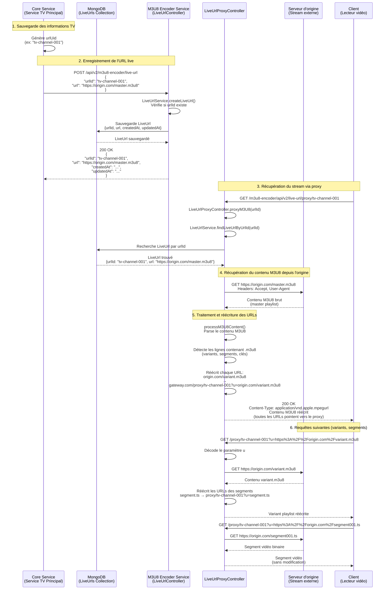

# Diagramme de séquence - Proxy HLS LiveUrl

Ce diagramme explique comment le système de proxy HLS fonctionne, depuis la création d'une URL live jusqu'à la récupération du stream.

## Flux complet



## Points clés

### 1. Génération de l'identifiant
- Le **Core Service** génère un `urlUid` unique lors de la sauvegarde des informations TV
- Ce `urlUid` devient le `urlId` dans le service M3U8 Encoder
- Le même `urlId` est utilisé pour toutes les opérations (création, récupération, proxy)

### 2. Enregistrement de l'URL
- Le Core Service envoie `urlId` + `url` (URL externe) au service M3U8 Encoder
- Le service sauvegarde cette association dans MongoDB
- L'URL externe peut être une playlist master M3U8 ou n'importe quelle URL de streaming

### 3. Proxy et réécriture d'URLs
- Le client accède au stream via `/proxy/{urlId}`
- Le proxy récupère l'URL externe depuis MongoDB en utilisant le `urlId`
- Le proxy fetch le contenu depuis l'origine
- **Toutes les URLs internes** (variants, segments, clés) sont réécrites pour passer par le proxy
- Le même `urlId` est utilisé dans toutes les URLs réécrites

### 4. Flux de requêtes
- **Requête initiale** : `GET /proxy/{urlId}` → récupère la master playlist
- **Requêtes imbriquées** : `GET /proxy/{urlId}?u={encoded_url}` → récupère variants/segments
- Le paramètre `u` contient l'URL originale encodée en URL
- Le proxy décode `u` et fetch depuis l'origine

## Exemple concret

### Étape 1 : Enregistrement
```json
POST /api/v2/m3u8-encoder/live-url
{
  "urlId": "dacast-stream-001",
  "url": "https://view.dacast.com/.../master.m3u8"
}
```

### Étape 2 : Accès au stream
```
GET /m3u8-encoder/api/v2/live-url/proxy/dacast-stream-001
```

### Étape 3 : URLs réécrites dans la réponse
```
#EXTM3U
#EXT-X-VERSION:3
#EXT-X-STREAM-INF:BANDWIDTH=2000000,RESOLUTION=1280x720
https://gateway.com/m3u8-encoder/api/v2/live-url/proxy/dacast-stream-001?u=https%3A%2F%2Fview.dacast.com%2F...%2Fvariant_720p.m3u8
```

### Étape 4 : Requête du variant
```
GET /m3u8-encoder/api/v2/live-url/proxy/dacast-stream-001?u=https%3A%2F%2Fview.dacast.com%2F...%2Fvariant_720p.m3u8
```

## Avantages de cette architecture

1. **Sécurité** : L'URL externe n'est jamais exposée directement au client
2. **CORS** : Le proxy gère les en-têtes CORS automatiquement
3. **Traçabilité** : Toutes les requêtes passent par le proxy avec le même `urlId`
4. **Flexibilité** : L'URL externe peut être changée sans affecter le client (via PUT)
5. **Cache** : Possibilité d'ajouter du cache au niveau du proxy

